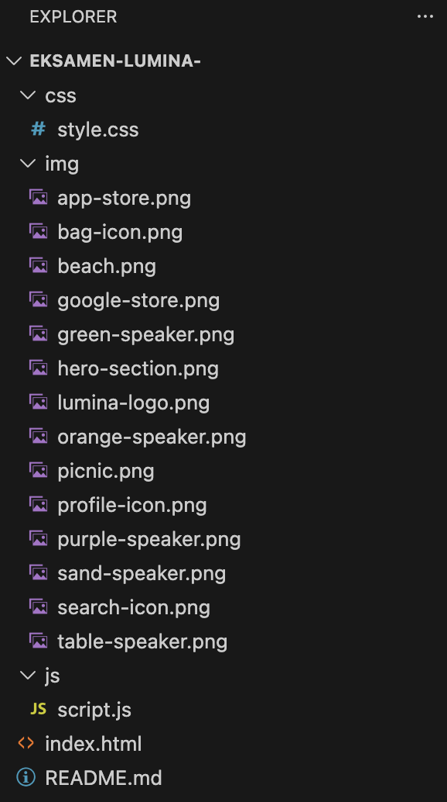

# eksamen-lumina-

# Opgaven

Formålet med projektet har været at forbedre en case, vi har arbejdet med på første semester.

Jeg har valgt at forbedre LUMINA ved at bruge HTML, CSS og lidt JavaScript til at gøre siden mere interaktiv.

Med JavaScript er det blevet muligt at skifte billeder i CTA-sektionen. Når man trykker på et af de små billeder under det store billede, skifter det store billede til det valgte billede. Dette er lavet med simpel JavaScript.

Det er også muligt at trykke på "Læs mere" i hero-sektionen. Når man gør det, scroller siden automatisk ned til informationssektionen. Dette er også lavet med simpel JavaScript.

# Mappestruktur

Der er lavet en simpel mappestruktur. en css mappe, med et css dokument. en image mappe med alle billederne i, små bogstaver og ingen mellemrum. en JS mappe med et JS dokument i.

# Validering

HTML der er ingen errors

CSS ingen errors eller warnings

# JavaScript

/*
Henter det store billede fra HTML.
Det er dette billede, der skal skifte, når brugeren klikker på et lille billede.
*/
const mainImage = document.querySelector(".main-img");

/*
Henter alle de små billeder.
querySelectorAll() bruges, fordi der er flere billeder med classen "small".
*/
const smallImages = document.querySelectorAll(".small");

/*
Vi går igennem hvert lille billede med forEach().
For hvert billede tilføjer vi en click-event.
*/
smallImages.forEach((small) => {
    small.addEventListener("click", () => {

        /*
        Når brugeren klikker på et lille billede,
        bliver src på det store billede ændret til src fra det lille billede.
        */
        mainImage.src = small.src;
    });
});

